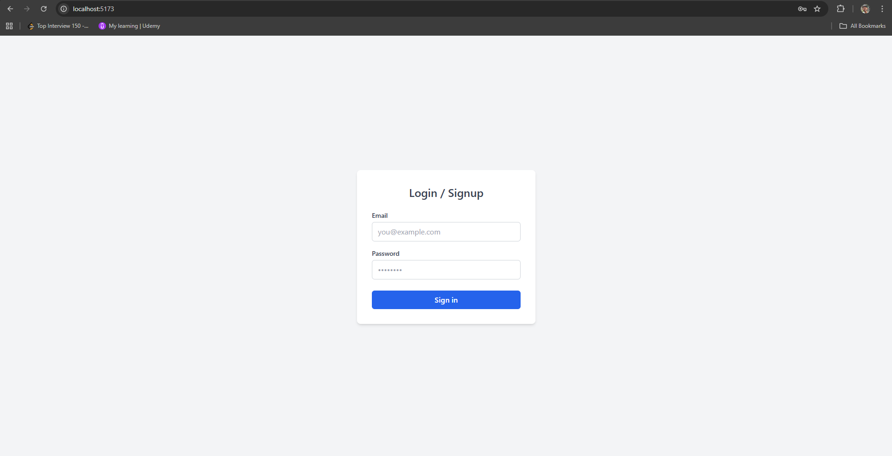
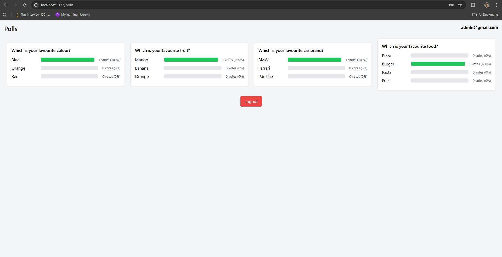

# Feedback App
A simple app where users can add their feedback.

---

## 🛠 Features
- Add feedback (name, email, feedbacl)
- View all feedbacks
- Responsive frontend using React and Tailwind CSS
- Backend using Node.js, Express, and local MongoDB compass

---

## 💻 Folder Structure
```text
PRT/
│
├─ server/
│  ├─ models/       # Models (feedback.js)
│  ├─ controllers/  # API routes (feedback.js)
│  ├─ index.js      # Express server running at:8000
│  └─ package.json
│
├─ client/          # Client running at :5173
│  ├─ src/
│  │  ├─ config/    # Routes (router.jsx)
│  │  ├─ pages/     # Pages (header.jsx, feedbackForm.jsx, feedbackList.jsx)
│  │  └─ main.jsx
│  └─ package.json
```


## ⚡ Requirements
- Node.js v18+
- npm (node package manager)
- MongoDB (local compass or Atlas cloud)


## 🚀 Getting Started
### Backend
1. Go to server folder:
```bash
cd server
npm install
MONGO_URI=<your_mongo_connection_string>
PORT=8000
nodemon or node server.js
```
The server will run on http://localhost:8000


### Frontend
2. Go to vite client folder:
```bash
cd client
npm install
npm run dev
```
The server will run on http://localhost:5173


### Screenshots
### Form Page



### Feedbacks Page


